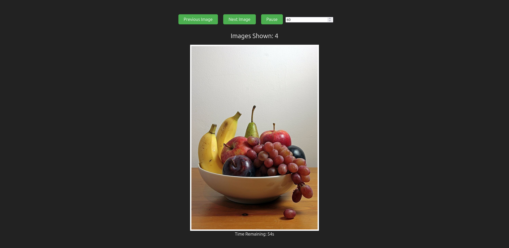
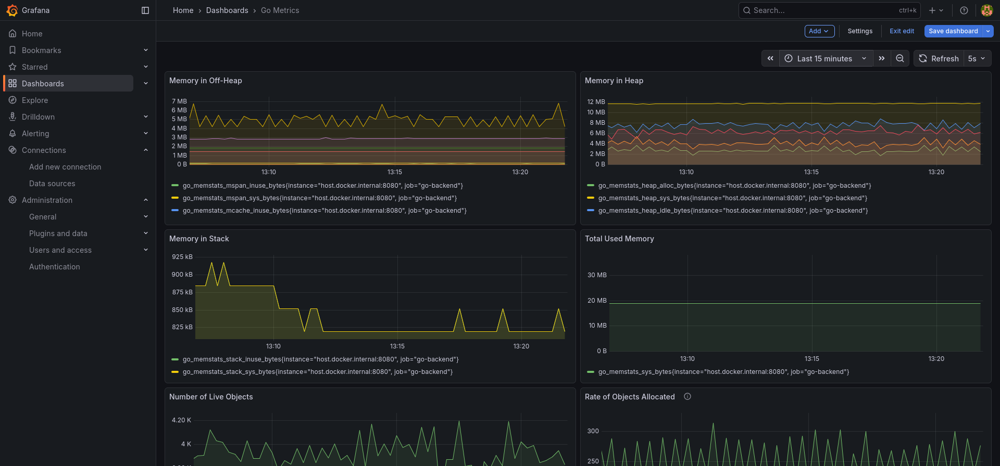

# Image Cycler

A full-stack image cycling application built with a **Spring Boot (Kotlin) / Golang backend (I tried both to see the difference)** and a **React (TypeScript) frontend**

> Designed to demonstrate modern backend performance optimization, observability, and a clean frontend integration.

---

## ✨ Features

- 🖼️ Cycles through images with configurable timing
- ⚡ Redis-backed caching for fast image metadata access
- 🔍 Structured logs via OpenTelemetry
- 📊 Metrics collection with Prometheus
- 📈 Grafana dashboards for system visibility

---

**High-level flow:**

1. React frontend requests image data
2. Spring Boot API serves requests
3. Redis caches image metadata and responses
4. OpenTelemetry exports logs and traces
5. Prometheus scrapes metrics
6. Grafana visualizes application health

---

## 🖥️ Frontend

- **Framework:** React
- **Language:** TypeScript
- **Responsibilities:**
  - Display cycling images
  - Handle user interaction
  - Communicate with backend API

<!-- Insert frontend screenshots here -->


---

## ⚙️ Backend

- **Framework:** Spring Boot
- **Language:** Kotlin
- **Responsibilities:**
  - Image metadata management
  - Cache orchestration
  - Metrics and tracing instrumentation

### Redis Cache

- Used to cache frequently accessed image data
- Reduces database/API load
- Improves response latency

---

## 🔍 Observability

### Prometheus Metrics

- Request latency
- Cache hit/miss rates
- JVM and application metrics

---

### Grafana Dashboards

<!-- Insert Grafana dashboard screenshots here -->


---

## 🚀 Getting Started

### Prerequisites

- Java 17+
- Node.js 18+
- Docker & Docker Compose
- Redis

---

### Running Locally

```bash
# Backend Kotlin version
./gradlew bootRun

# Backend Golang version
go run main.go

# Frontend
npm install
npm start 
```


### System Design
I wanted to make this while thinking about how it would scale up as a service that gets regular use. For the sake of argument, lets say 1M people come on to the site every day. Use would vary from person to person, but I would say on average people would look at about 20 images. Assuming an image is around 500 KB, this would essentially mean we have to serve 1M * 20  * 500 KB = 10 TB to users a day.

Because images are served randomly rather than personalized, I don't need to tailor the image set to a person's preferences in the way youtube has to recommend videos to each individual user. I could store 100 images in the redis cache and swap in a new hundred every hour and it would serve most people's needs. To prevent a user from getting the same image multiple times we could increase the total number of images stored in the cache (100 -> 500) and/or increase the frequency at which we replace images in the cache (every hour ->  every 10 minutes).

I currently have the image bytes stored in the redis cache, but if we were to attach a CDN we can cache the images there and track the urls on the backend so we can pick a random one to serve. This wouldn't change the fact that we have to move 10 TB of data daily, but most of the load would be on the more geographically convinient CDN.

We only serve images, so there isn't anything to write to the system, unless we wanted to store login info but even then it's minor compared to the data that needs to be read.

